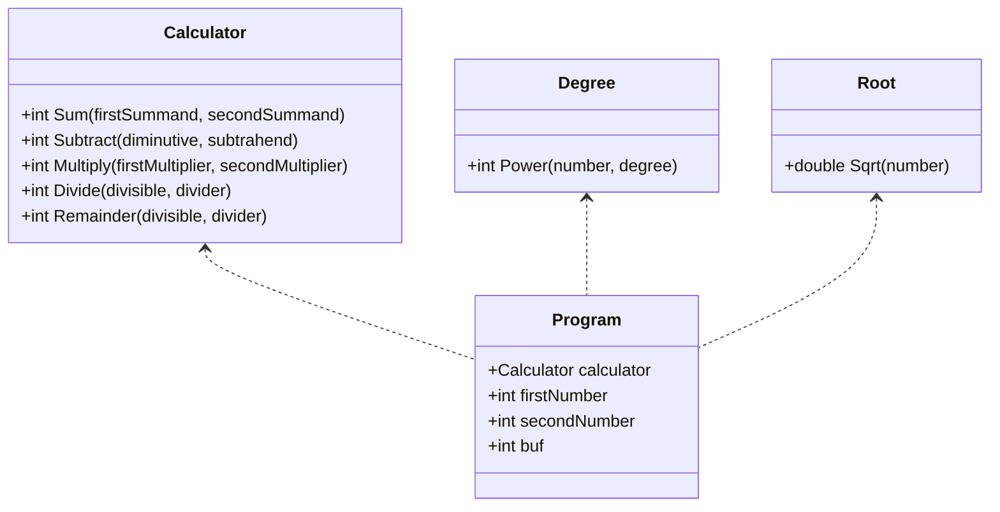

```mermaid
classDiagram
class Program{
 +Calculator calculator
 +int firstNumber
 +int secondNumber
 +int buf
}
class Calculator{
 +int Sum(firstSummand, secondSummand)
 +int Subtract(diminutive, subtrahend)
 +int Multiply(firstMultiplier, secondMultiplier)
 +int Divide(divisible, divider)
 +int Remainder(divisible, divider)
}
class Degree{
 +int Power(number, degree)
}
class Root{
 +double Sqrt(number)
}
Calculator <.. Program
Degree <.. Program
Root <.. Program
```
